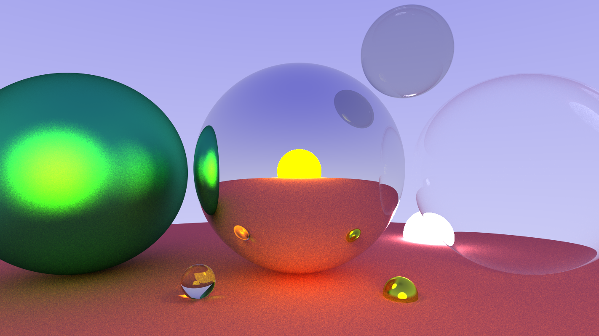

# path-tracer
Implementation of a path tracer in Rust

# Features

- Render pipeline:
    - Shapes
        - Sphere
        - World (collection of shapes)
    - Materials
        - Lighting
        - Transparency
        - Metals
        - Glass
        - Lambertians
        - Dielectrics
    - Camera
        - FOV
        - Focal length
        - Position
- Image:
    - In-memory buffer of canvas data
    - Utility methods to iterate over each `(x, y)` pixel
    - Buffered write of pixel data, reaching ≈9.5k pixels-per-milisecond (p/ms) on i7-6700K
